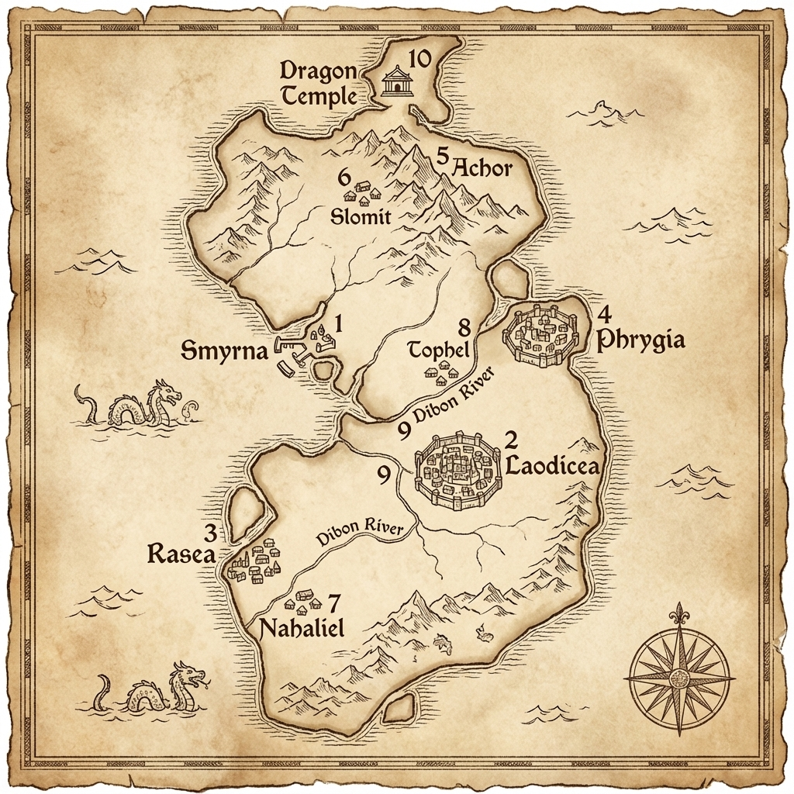
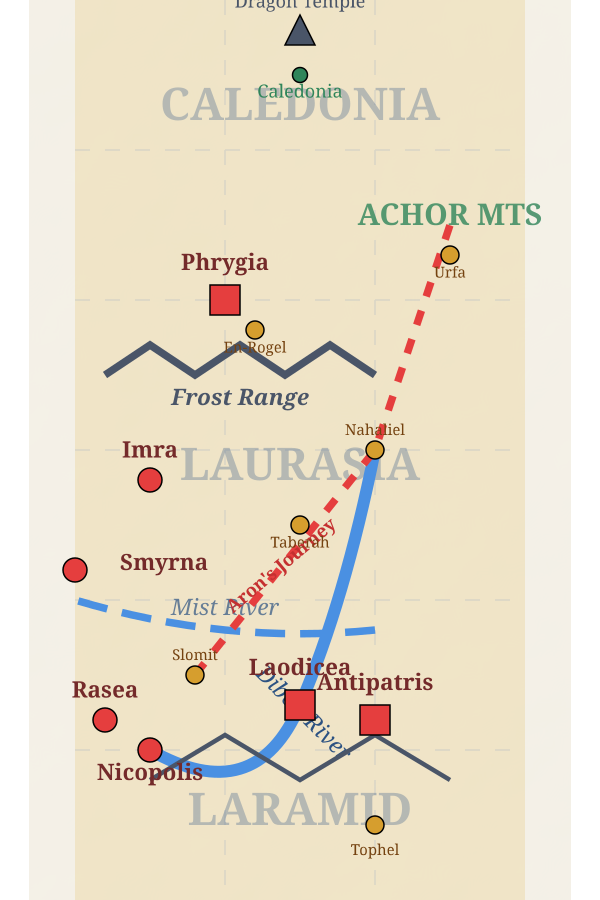
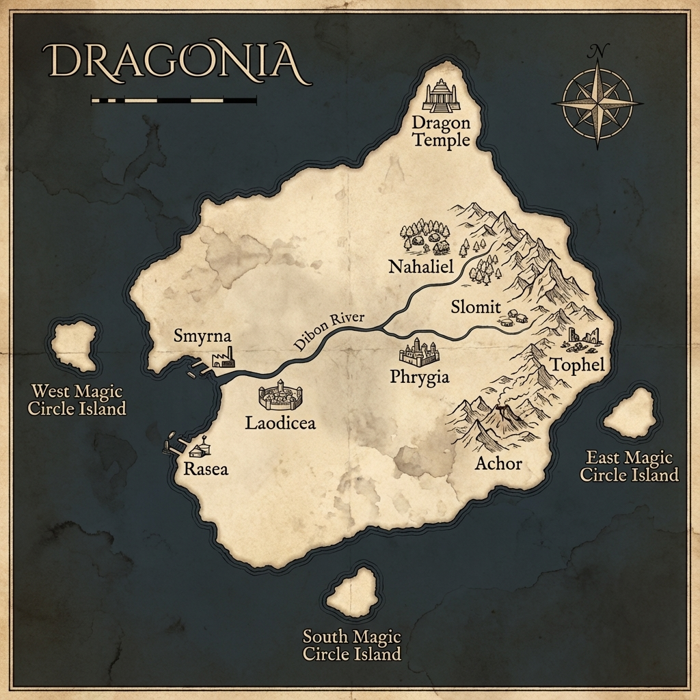
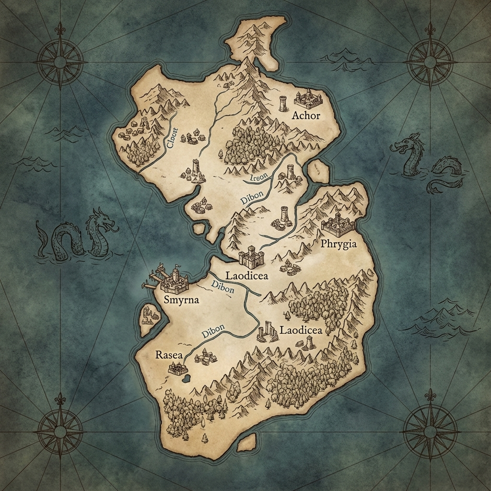
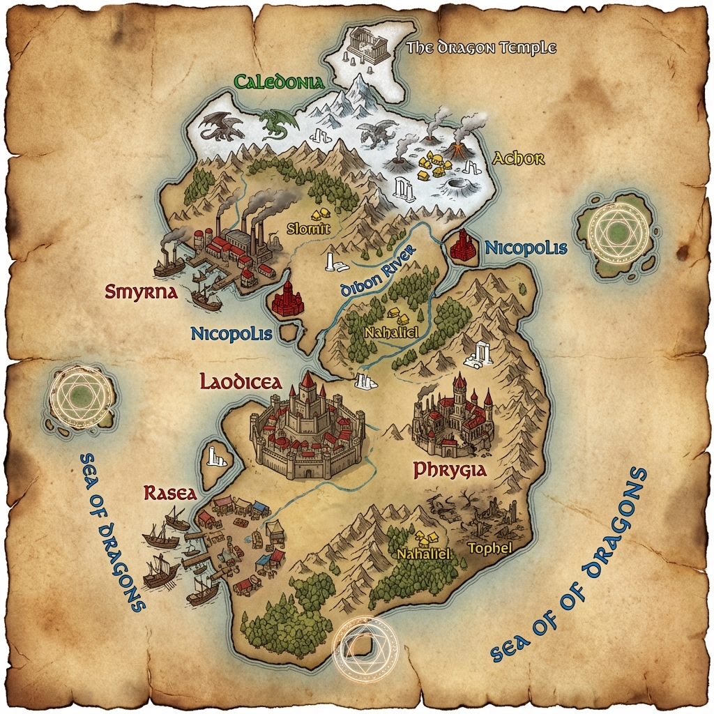
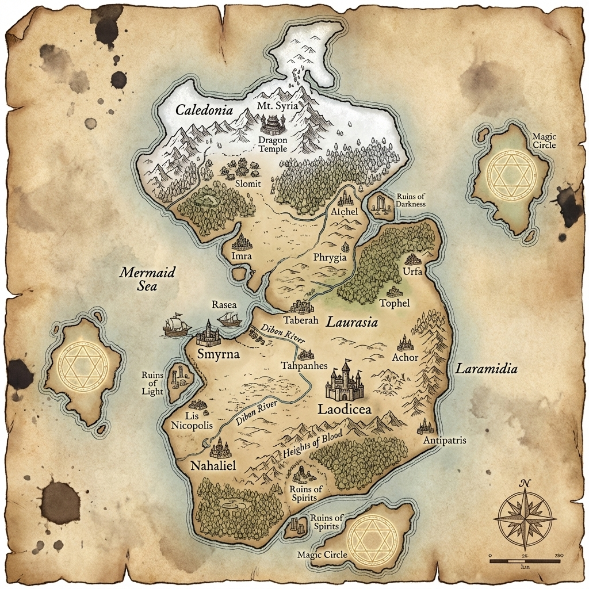
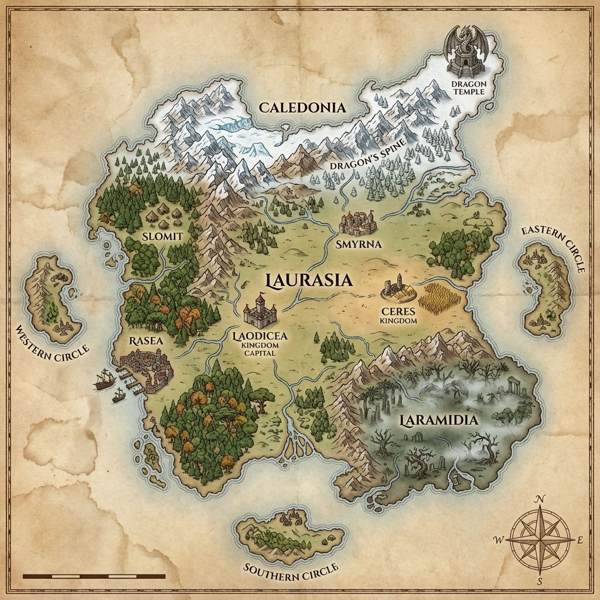

# Dragonia Legend Fantasy Map (Refined)

사용자의 피드백을 반영하여 **위치 정확도**를 높이고, **아이콘 크기를 줄여** 가독성을 개선한 최종 지도입니다. 인위적인 색상 마커 대신 자연스러운 판타지 지도 스타일을 적용했습니다.

## 🗺️ 개선 사항 (Improvements)

1.  **위치 및 레이아웃 교정:** 참조 이미지(`41-map-서머나-라오디게아.jpg`)의 레이아웃을 엄격하게 따랐습니다. 서머나, 라오디게아, 라새아 등의 상대적 위치를 조정했습니다.
2.  **아이콘 크기 축소:** 맵 이동 및 탐험에 용이하도록 도시와 마을의 아이콘 크기를 줄이고 디테일을 살렸습니다.
3.  **자연스러운 스타일:** 원색 마커 대신 고풍스러운 양피지 스타일과 자연스러운 잉크 색상을 사용하여 판타지 세계관에 어울리는 분위기를 연출했습니다.

## 📍 포함된 지명 목록 (Included Locations)

| 한글명 | 영문명 | 분류 | 비고 |
| :--- | :--- | :--- | :--- |
| **라오디게아** | Laodicea | 대도시 | 수도, 내륙 요새 |
| **서머나** | Smyrna | 대도시 | 서쪽 항구, 산업 중심지 |
| **브루기아** | Phrygia | 대도시 | 동쪽, 세레스 수도 |
| **라새아** | Rasea | 대도시 | 서쪽 상업 항구 |
| **이므라** | Imra | 대도시 | 교역항 |
| **니고볼리** | Nicopolis | 대도시 | 디본강 하구 |
| **안디바드리** | Antipatris | 대도시 | 내륙 요새 |
| **슬로밋** | Slomit | 마을 | 숲 속 작은 마을 |
| **나할리엘** | Nahaliel | 마을 | 디본강 상류 |
| **리스** | Lis | 마을 | 온천 마을 |
| **버가모** | Pergamon | 마을 | 유적지 근처 |
| **다베라** | Taberah | 마을 | 여관 마을 |
| **도벨** | Tophel | 마을 | 전선 마을 (폐허) |
| **아골** | Achor | 지역 | 북동쪽 험준한 산악 |
| **디본강** | Dibon River | 강 | 대륙을 가로지르는 강 |
| **인어의 바다** | Mermaid's Sea | 바다 | 서쪽 바다 |
| **용의 신전** | Dragon Temple | 유적 | 북쪽 끝 |
| **빛의 유적** | Ruins of Light | 유적 | 아골 골짜기 내 |

더 자세한 정보는 [지명 상세 문서](map_locations.md)를 참고하세요.

---

## 5. 가상 지구 모델 (Virtual Earth Geography)

소설 속 날씨, 기후, 이동 시간을 바탕으로 **위도(Latitude)와 경도(Longitude)**를 적용한 정밀 지리 모델입니다.

*   **모델 문서:** [map_geography_model.md](map_geography_model.md)
*   **3대 지역 (Regions):**
    *   **북부: 칼레도니아 (Caledonia):** 춥고 험준한 산악 (세레스).
    *   **중부: 로라시아 (Laurasia):** 온화한 숲과 평원 (교역로).
    *   **남부: 라라미드 (Laramid):** 따뜻한 곡창 지대 (라오디게아).
*   **스토리 논리 (Story Logic):**
    *   **아론의 여정:** 남서쪽(슬로밋) ➡️ 북동쪽(아골)으로 향하는 대각선 북상 경로.
    *   **디본강:** 북동쪽 산지에서 발원하여 남서쪽 바다로 흐르는 대륙의 젖줄.

---

## 6. 지도 생성 명세서 (Map Generation Specification)

이미지 생성을 위한 **최종 확정 정보(스타일, 지리, 시각적 묘사)**를 정리한 문서입니다. 이 명세서를 바탕으로 최종 이미지가 생성됩니다.

*   **명세서 문서:** [map_generation_spec.md](map_generation_spec.md)
*   **포함 내용:**
    *   **전체 스타일:** 반지의 제왕 스타일, 양피지 질감.
    *   **지리적 특징:** 아골 산맥, 디본강의 정확한 흐름.
    *   **지명별 프롬프트:** 각 도시/마을의 시각적 키워드 (예: 서머나-산업항구, 라오디게아-성벽도시).

---

## 7. 벡터 지도 (Scalable Vector Map)

좌표계를 기반으로 생성된 SVG 지도입니다. 확대해도 깨지지 않으며, 정확한 위치 수정이 용이합니다.

---

## 6. 지도 생성 기록 (Map Generation History)

이전에 생성된 모든 지도 버전입니다.

### v6 (Latest - Layout Restored)

### v5 (No Duplicates)

### v4 (Refined Style)

### v3 (Color Coded)

### v2 (Expanded Locations)

### v1 (Initial)

---

## 6. 다음 단계 (Next Steps - Final Generation)

사용자의 피드백(v1 스타일 + v2/v3 정확도 + 지리적 수정)을 반영하여 쿼터 초기화 후 다음 작업을 수행할 예정입니다.

**최종 지도 생성 목표:**
1.  **스타일 (Style):** v1의 고풍스럽고 자연스러운 양피지/손그림 스타일 복원.
2.  **정확도 (Accuracy):** v2/v3의 풍부한 지명 포함 (모든 마을 및 유적).
3.  **지리적 수정 (Corrections):**
    *   **브루기아 (Phrygia):** 동쪽으로 이동 (아골/우르파와 분리).
    *   **디본강 (Dibon River):** 라오디게아를 관통하는 대륙의 주요 강으로 묘사.
    *   **중복 제거:** 지명 라벨 중복 방지.

